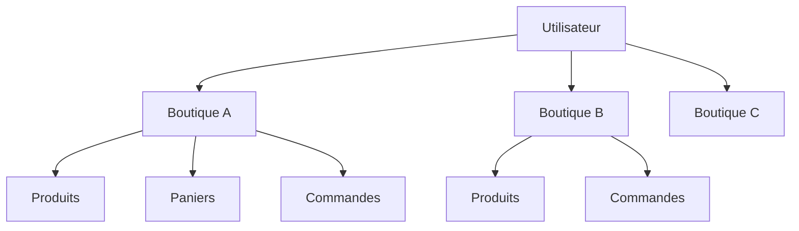
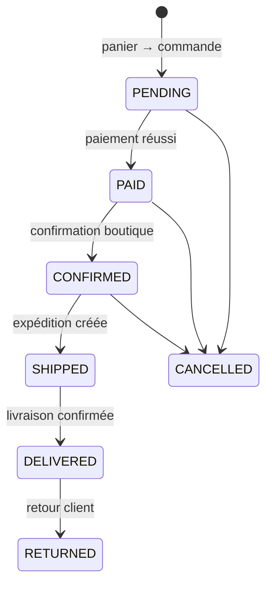

# ShopFlow

[](https://github.com/EagleFox31/shopflow/actions/workflows/ci.yml)

**Un backend de commerce multi-boutiques où un même compte peut posséder plusieurs boutiques, déléguer leur administration et gérer les catalogues, paniers, paiements ainsi que tout le cycle de vie des commandes.**

ShopFlow a été construit comme un projet pratique Python/FastAPI et a évolué d’un CRUD fortement centré sur les routers vers une architecture organisée autour d’une couche de services métier.

---

## Ce que modélise ShopFlow

Un utilisateur n’est pas limité à une seule boutique.



Le propriétaire d’une boutique peut également déléguer sa gestion à d’autres utilisateurs grâce aux permissions `ShopAdmin`. Les rôles globaux de la plateforme (`Role` / `UserRole`) restent séparés des permissions propres à chaque boutique.

## Architecture

```text
Requête HTTP
    ↓
Router FastAPI
    ├─ authentification / dépendances
    ├─ contrat de requête Pydantic
    └─ appel du service
           ↓
Service métier
    ├─ règles métier
    ├─ autorisation au niveau de la boutique
    ├─ orchestration
    └─ transitions d’état
           ↓
Session SQLAlchemy
           ↓
PostgreSQL
```

Le projet utilise volontairement **un fichier de service par domaine métier** :

```text
address_service      cart_service          cart_item_service
category_service     product_service       order_service
payment_service      shop_service          shop_admin_service
user_service         role_service          user_role_service
auth/token_service   shipment_service      notification_service
```

Cette architecture a remplacé l’approche initiale où une grande partie de la logique métier était directement placée dans les routers.

## Cycle de vie d’une commande

`order_service.py` joue le rôle d’orchestrateur central.



Chaque transition est historisée dans `OrderStatusHistory`. Les données produit sont figées dans `OrderItem`, le stock est réservé lors de la création de la commande et il est restauré en cas d’annulation ou de retour.

## Principaux domaines métier

**Identité** — inscription, connexion, JWT access/refresh, changement de mot de passe et rôles globaux.

**Multi-boutiques** — un utilisateur peut posséder plusieurs boutiques ; des administrateurs peuvent recevoir des permissions granulaires sur une boutique donnée.

**Catalogue** — catégories et produits isolés par boutique, SKU unique au sein d’une boutique, gestion du stock et des règles de disponibilité.

**Panier** — un seul panier actif par utilisateur et par boutique, ajout/mise à jour des articles, validation des quantités et recalcul automatique des totaux.

**Commandes** — création depuis le panier, consultation, liste, mise à jour avant confirmation, annulation, confirmation, expédition, livraison, retour et historique d’état.

**Paiements** — initiation, succès/échec et remboursement lors d’une annulation ou d’un retour. L’intégration à un prestataire de paiement reste isolée derrière le service de paiement.

**Livraison et notifications** — domaines séparés afin que la logique de commande ne dépende pas directement d’un transporteur ou d’un fournisseur de messagerie spécifique.

## Structure du dépôt

```text
shopflow/
├── app/
│   ├── api/
│   │   ├── deps.py
│   │   ├── router.py
│   │   └── routes/
│   ├── core/
│   │   ├── config.py
│   │   ├── exceptions.py
│   │   └── security.py
│   ├── db/
│   │   ├── base.py
│   │   └── session.py
│   ├── models/
│   ├── schemas/
│   ├── services/
│   └── main.py
├── alembic/
│   └── versions/
├── docs/
│   ├── ARCHITECTURE.md
│   └── API_CONTRACTS.md
├── scripts/
│   └── seed_roles.py
├── tests/
├── docker-compose.yml
├── pyproject.toml
└── README.md
```

## Stack technique

- Python 3.11+
- FastAPI
- SQLAlchemy 2
- PostgreSQL
- Alembic
- Pydantic v2
- Authentification JWT
- Hachage des mots de passe avec Argon2
- Pytest

## Démarrage rapide

### 1. Démarrer PostgreSQL

```bash
docker compose up -d postgres
```

### 2. Installer les dépendances

```bash
poetry install
```

### 3. Configurer l’environnement

Linux/macOS :

```bash
cp .env.example .env
```

Windows PowerShell :

```powershell
Copy-Item .env.example .env
```

Pense à remplacer `SECRET_KEY` avant toute utilisation en dehors d’un environnement local de développement.

### 4. Créer le schéma de base de données

```bash
poetry run alembic upgrade head
```

### 5. Lancer l’API

```bash
poetry run uvicorn app.main:app --reload
```

Accès utiles :

- Swagger UI : `http://127.0.0.1:8000/docs`
- ReDoc : `http://127.0.0.1:8000/redoc`
- OpenAPI JSON : `http://127.0.0.1:8000/openapi.json`
- Santé de l’application : `http://127.0.0.1:8000/health`

## Contrôles qualité

ShopFlow n’est pas considéré comme prêt à intégrer simplement parce que quelques scénarios heureux passent. La CI valide le backend à plusieurs niveaux :

- compilation Python et contrôles statiques Ruff ;
- tests des contrats requête/réponse et du schéma OpenAPI ;
- authentification, refresh token et échecs d’autorisation ;
- isolation multi-boutiques et permissions déléguées ;
- règles catalogue, adresse, panier et contraintes d’unicité en base ;
- transitions d’état des commandes, annulation, paiement et retour ;
- migration PostgreSQL 16 depuis une base vide ;
- `alembic check` pour détecter les écarts entre modèles et migrations ;
- downgrade complet d’Alembic jusqu’à `base`, puis remontée jusqu’à `head` ;
- exécution de la suite d’intégration sur PostgreSQL, et pas uniquement SQLite ;
- scénario E2E HTTP réel contre un processus Uvicorn en cours d’exécution et PostgreSQL.

La suite locale rapide se lance avec :

```bash
poetry run pytest -q
```

La validation PostgreSQL et le scénario E2E réel sont reproduits automatiquement par GitHub Actions. Voir [`docs/TESTING.md`](docs/TESTING.md) pour la matrice de tests détaillée.

## Surface de l’API

L’API est versionnée sous `/api/v1`.

```text
/auth/*                         identité + JWT
/users/*                        profil de l’utilisateur courant
/addresses/*                    adresses client
/shops/*                        propriété et administration multi-boutiques
/shops/{shop_id}/categories/*   catalogue de la boutique
/shops/{shop_id}/products/*     produits de la boutique
/shops/{shop_id}/cart/*         panier client par boutique
/shops/{shop_id}/orders         file de commandes de la boutique
/orders/*                       cycle de vie des commandes
/orders/{id}/payments/*         cycle de vie des paiements
/admin/*                        rôles globaux de la plateforme
```

Pour la liste complète des requêtes et réponses, voir **[docs/API_CONTRACTS.md](docs/API_CONTRACTS.md)**.

Pour les choix d’architecture, les responsabilités de la couche de services et les frontières de la base de données, voir **[docs/ARCHITECTURE.md](docs/ARCHITECTURE.md)**.

## Principes de conception

- **Les routers gèrent HTTP ; les services portent la logique métier.**
- **Toute modification liée à une boutique vérifie les permissions de cette boutique.**
- **Les statuts d’une commande ne sont pas modifiés directement par un simple patch.**
- **Les workflows impliquant plusieurs domaines sont coordonnés dans `order_service`.**
- **Les prestataires de paiement, livraison et notification restent remplaçables.**
- **L’historique d’une commande reste cohérent même si le catalogue change ensuite.**

---

ShopFlow est volontairement structuré comme un vrai backend sans transformer chaque fonction en dossier séparé. Le code doit rester assez lisible pour servir de support d’apprentissage, tout en exposant les décisions d’architecture attendues dans un projet Python orienté production.
