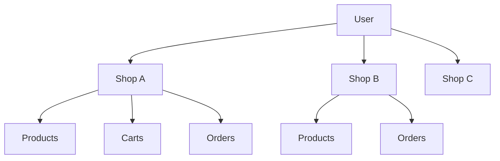
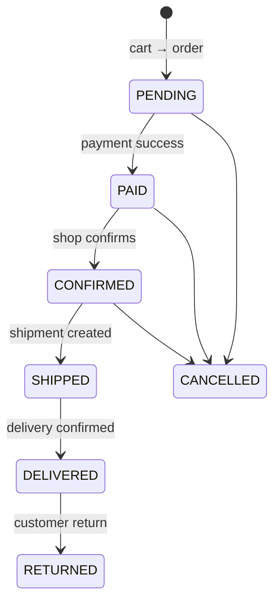

# ShopFlow

**A multi-shop commerce backend where one account can own several stores, delegate store administration, manage catalogues, carts, payments and the full order lifecycle.**

ShopFlow was built as a practical Python/FastAPI project and evolved from router-heavy CRUD into a domain-oriented service layer.

---

## What ShopFlow models

One user is not tied to one store.



A shop owner can also delegate management to other users through `ShopAdmin` permissions. Global platform roles (`Role` / `UserRole`) remain separate from per-shop permissions.

## Architecture

```text
HTTP request
    ↓
FastAPI router
    ├─ authentication / dependencies
    ├─ Pydantic request contract
    └─ service call
           ↓
Domain service
    ├─ business rules
    ├─ authorization at shop boundary
    ├─ orchestration
    └─ state transitions
           ↓
SQLAlchemy session
           ↓
PostgreSQL
```

The project deliberately uses **one service file per business domain**:

```text
address_service      cart_service          cart_item_service
category_service     product_service       order_service
payment_service      shop_service          shop_admin_service
user_service         role_service          user_role_service
auth/token_service   shipment_service      notification_service
```

This is the architecture that replaced the original “business logic inside routers” approach.

## Order lifecycle

`order_service.py` is the central orchestrator.



Every transition is audited in `OrderStatusHistory`. Product data is snapshotted into `OrderItem`, stock is reserved during order creation, and cancellation/return releases stock.

## Main domains

**Identity** — registration, login, access/refresh JWTs, password changes, global roles.

**Multi-shop** — a user can own several shops; shop admins can be delegated granular permissions.

**Catalogue** — shop-scoped categories and products, unique SKU per shop, stock and availability rules.

**Cart** — one active cart per user/shop, item upsert, quantity validation, automatic totals.

**Orders** — create from cart, consult/list, update before confirmation, cancel, confirm, ship, deliver, return, audit history.

**Payments** — initiate, mark success/failure, refund during cancellation/return. Provider integration stays behind the payment service.

**Shipping & notifications** — separate service boundaries so order logic does not depend on one carrier or messaging vendor.

## Repository structure

```text
shopflow/
├── app/
│   ├── api/
│   │   ├── deps.py
│   │   ├── router.py
│   │   └── routes/
│   ├── core/
│   │   ├── config.py
│   │   ├── exceptions.py
│   │   └── security.py
│   ├── db/
│   │   ├── base.py
│   │   └── session.py
│   ├── models/
│   ├── schemas/
│   ├── services/
│   └── main.py
├── alembic/
│   └── versions/
├── docs/
│   ├── ARCHITECTURE.md
│   └── API_CONTRACTS.md
├── scripts/
│   └── seed_roles.py
├── tests/
├── docker-compose.yml
├── pyproject.toml
└── README.md
```

## Tech stack

- Python 3.11+
- FastAPI
- SQLAlchemy 2
- PostgreSQL
- Alembic
- Pydantic v2
- JWT authentication
- Argon2 password hashing
- Pytest

## Quick start

### 1. Start PostgreSQL

```bash
docker compose up -d postgres
```

### 2. Install dependencies

```bash
poetry install
```

### 3. Configure environment

Linux/macOS:

```bash
cp .env.example .env
```

Windows PowerShell:

```powershell
Copy-Item .env.example .env
```

Change `SECRET_KEY` before using the application outside local development.

### 4. Create the database schema

```bash
poetry run alembic upgrade head
```

### 5. Run the API

```bash
poetry run uvicorn app.main:app --reload
```

Open:

- Swagger UI: `http://127.0.0.1:8000/docs`
- ReDoc: `http://127.0.0.1:8000/redoc`
- OpenAPI JSON: `http://127.0.0.1:8000/openapi.json`
- Health: `http://127.0.0.1:8000/health`

## API surface

The API is versioned under `/api/v1`.

```text
/auth/*                         identity + JWT
/users/*                        current-user profile
/addresses/*                    customer addresses
/shops/*                        multi-shop ownership/admins
/shops/{shop_id}/categories/*   shop catalogue
/shops/{shop_id}/products/*     shop products
/shops/{shop_id}/cart/*         customer cart per shop
/shops/{shop_id}/orders         shop order queue
/orders/*                       order lifecycle
/orders/{id}/payments/*         payment lifecycle
/admin/*                        platform-wide roles
```

For the full request/response map, see **[docs/API_CONTRACTS.md](docs/API_CONTRACTS.md)**.

For the service-layer rationale and database boundaries, see **[docs/ARCHITECTURE.md](docs/ARCHITECTURE.md)**.

## Design rules

- **Routers orchestrate HTTP; services own business logic.**
- **Every shop-scoped mutation verifies shop permissions.**
- **Order states cannot be patched directly.**
- **Cross-domain workflows are coordinated in `order_service`.**
- **Payment/shipping/notification providers stay replaceable.**
- **Historical order data is preserved even when the catalogue changes.**

---

ShopFlow is intentionally structured like a real backend without turning every function into its own folder. The code should remain understandable enough to teach from, while exposing the architectural decisions expected in a production-oriented Python project.
