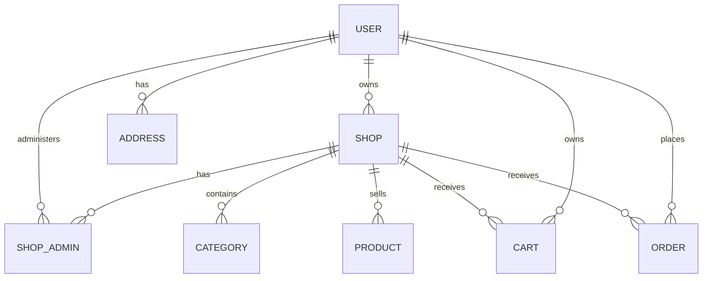
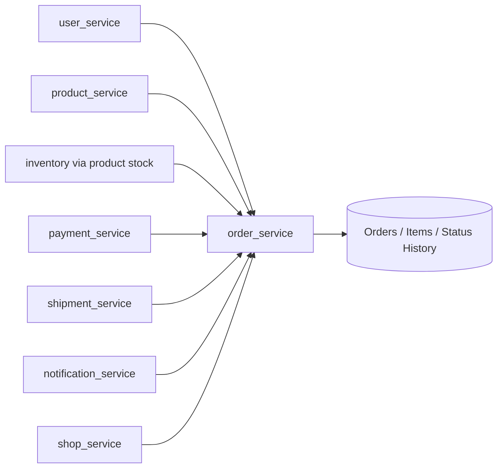
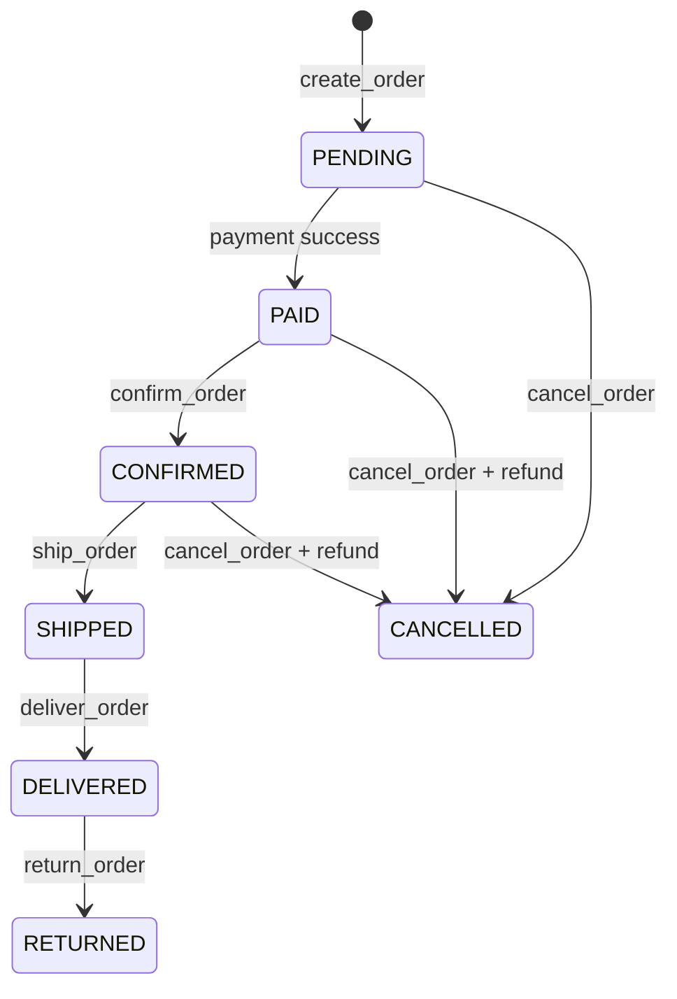

# ShopFlow Architecture

ShopFlow uses the centralized **service-layer-by-domain** architecture captured during the project's evolution.

## Why the architecture changed

The first version placed business rules, SQLAlchemy calls, validation and HTTP concerns directly in FastAPI routers. That worked while the project was small, but order management quickly turned the router into a business-logic container.

The refactor moved business logic into domain services:

```text
Before
Client → Router [HTTP + validation + business rules + DB access] → Database

After
Client → Router [HTTP + schema validation]
              ↓
          Service layer [business rules + orchestration]
              ↓
          SQLAlchemy / Database
```

Routers now translate HTTP into service calls. Services own domain rules and orchestration.

## Domain service layer

```text
app/services/
├── address_service.py
├── auth_service.py
├── cart_service.py
├── cart_item_service.py
├── category_service.py
├── health_service.py
├── notification_service.py
├── order_service.py
├── payment_service.py
├── product_service.py
├── role_service.py
├── shipment_service.py
├── shop_service.py
├── shop_admin_service.py
├── token_service.py
├── user_service.py
└── user_role_service.py
```

This is intentionally **one service file per domain**, not one file per use case.

## Multi-shop model

A user can own multiple shops and can also administer shops owned by other users.



All catalog and order-management operations are scoped by `shop_id`. Shop owners have full permissions. Shop admins receive explicit catalog/order/user-management permissions.

## Order service as orchestrator

`order_service.py` is the richest domain service. It coordinates several other services while keeping the router thin.



### Order lifecycle



Every status transition is written to `order_status_history`.

## Database boundaries

The first migration creates:

- users, roles and user_roles
- shops and shop_admins
- addresses
- categories and products
- carts and cart_items
- orders, order_items and order_status_history
- payments
- shipments

`OrderItem` stores a product snapshot (`product_name`, `sku`, `unit_price`) so historical orders remain meaningful even if the catalog changes later.

## API contracts

Pydantic schemas live in `app/schemas/`. They are the typed contracts between HTTP routes and services. FastAPI exposes the generated OpenAPI contract at:

- `/docs`
- `/redoc`
- `/openapi.json`

The human-readable contract catalogue is in [`API_CONTRACTS.md`](API_CONTRACTS.md).

## Cross-cutting rules

1. Routers stay thin: HTTP, dependency injection, response model, service call.
2. Domain errors are raised from the service layer and converted to HTTP centrally.
3. Shop-scoped resources are always validated against the active `shop_id`.
4. Order state transitions are explicit; callers cannot set `status` directly.
5. Stock is reserved when an order is created and released on cancellation/return. Product rows are locked during reservation on databases that support `SELECT ... FOR UPDATE` to reduce overselling races.
6. Payment and shipping are independent domains coordinated by `order_service`.
7. Notifications are an infrastructure hook, not a dependency hard-coded into the order domain.
8. One active cart per user/shop is enforced by a partial unique database index.
9. PostgreSQL migrations are checked against SQLAlchemy metadata in CI with `alembic check`.
